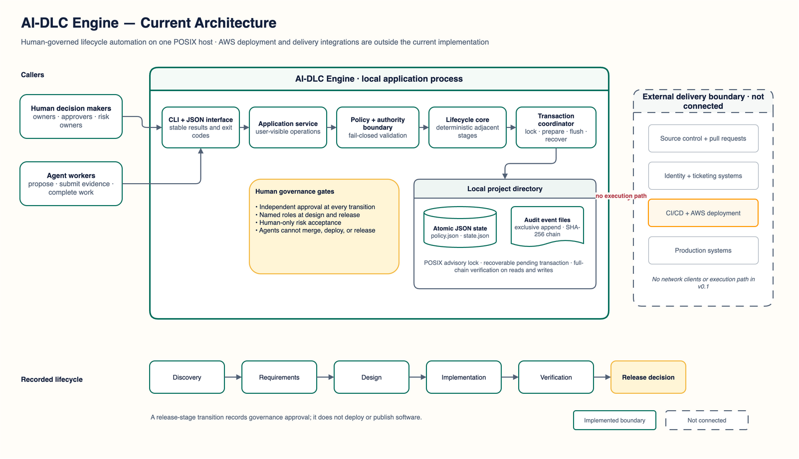

# AI-DLC Engine

[](https://github.com/hk-775/aidlc-engine/actions/workflows/ci.yml)
[](LICENSE)
[](pyproject.toml)

AI-DLC Engine is the human-governed automation engine for the AI Development
Lifecycle (AI-DLC) framework. It automates lifecycle state, evidence
requirements, bounded work assignments, approval gates, and audit records
while keeping risk and release authority with people.

This repository is an open-source project at **alpha** maturity. The current
implementation is designed for local evaluation on one POSIX host. It is not
a production authorization service.

[Project site](https://hk-775.github.io/aidlc-engine/) ·
[Architecture explorer](https://hk-775.github.io/aidlc-engine/architecture.html) ·
[Architecture reference](docs/ARCHITECTURE.md) ·
[Quickstart](QUICKSTART.md) ·
[Security](SECURITY.md) ·
[Changelog](CHANGELOG.md)



Editable source: [draw.io architecture diagram](site/assets/architecture.drawio)

## What it does

- Implements a fixed lifecycle: discovery, requirements, design,
  implementation, verification, and release.
- Applies configurable artifact requirements before stage transitions.
- Tracks proposed, approved, and completed agent work assignments.
- Requires independent human approval for every transition.
- Requires named human roles at high-impact design and release gates.
- Records each state change as an exclusively created, hash-linked JSON event.
- Uses atomic state writes and a recoverable local transaction marker.
- Returns structured JSON from the command line.
- Provides deterministic identifiers and timestamps when a provider is
  injected.
- Includes a synthetic end-to-end demo and an offline static project site.

## The three layers

| Layer | Responsibility | Source |
| --- | --- | --- |
| Interface | Parse commands, construct asserted actors, and return stable JSON results | `aidlc_engine.cli` |
| Governance engine | Validate policy and authority, apply lifecycle operations, and enforce human gates | `aidlc_engine.service`, `aidlc_engine.policy`, `aidlc_engine.models` |
| Evidence store | Commit atomic state and exclusively created, hash-linked audit events | `aidlc_engine.persistence`, `aidlc_engine.audit` |

## Authority boundary

Agents can:

- propose work for themselves;
- submit an artifact within an approved assignment;
- complete assigned work after its deliverables are registered; and
- propose the next adjacent lifecycle transition.

Agents cannot:

- merge changes;
- deploy software;
- execute a release;
- accept risk;
- approve a transition they proposed;
- satisfy a human gate; or
- bypass a required gate.

AI-DLC Engine does not connect to source-control, deployment, identity,
ticketing, or production systems. Reaching the `release` stage records a
governance decision; it does not publish or deploy anything.

## Requirements

- `uv`
- Python 3.11 or newer, installed locally or managed by `uv`
- A POSIX operating system with advisory file locking
- No runtime Python packages
- Make is optional

## See it in 60 seconds

Clone the canonical repository and install the isolated command-line tool:

```console
git clone https://github.com/hk-775/aidlc-engine.git
cd aidlc-engine
uv tool install .
```

Run the deterministic demonstration through the installed command:

```console
aidlc-engine --store .tmp/my-demo demo
```

The demo should report the `release` stage, 32 valid audit events, five
artifacts, five assignments, and five transition proposals.

## Fast evaluation

Run the complete local checks from the cloned repository:

```console
make test
make scan
make history-scan
make demo
make package-check
```

To inspect the static site locally:

```console
make site
```

Then open the local address printed by Python. The site has no telemetry,
cookies, remote fonts, content delivery networks, or network APIs.
Open `/architecture.html` for the interactive architecture explorer and
downloadable diagram sources.

## Command-line shape

Every successful command emits an object with `"ok": true`. Expected failures
emit an object with `"ok": false`, a stable error code, a message, and details,
then return a nonzero exit status.

```console
aidlc-engine \
  --store .aidlc-engine-example \
  --id-seed evaluation \
  --fixed-time 2026-01-15T12:00:00Z \
  init \
  --name "Sample intake service" \
  --description "Synthetic local evaluation" \
  --actor-id human_owner \
  --actor-kind human \
  --role project_owner
```

See [QUICKSTART.md](QUICKSTART.md) for a guided workflow and
[STARTUP.md](STARTUP.md) for the evaluator checklist.

## Local storage

One initialized project directory contains:

```text
state.json
policy.json
audit/
  00000001-event_....json
.aidlc.lock
```

A short-lived `.aidlc.pending.json` file can appear during a transaction. On
the next locked operation, AI-DLC Engine completes a valid pending write before
reading state. These two internal filenames remain unchanged from the v1 store
format so existing stores stay safe and readable. A legacy store can be opened
by passing its path explicitly, for example `--store .aidlc`.

Audit event files are created exclusively and are never updated by the
application. Their hash chain detects later modification, deletion, insertion,
or reordering, and the final event binds the current state content. This does
not provide cryptographic authorship or protection against an administrator
who can replace the entire store.

## Project layout

```text
src/aidlc_engine/  lifecycle, policy, persistence, audit, CLI, and demo
tests/             standard-library unit and integration tests
schemas/           JSON Schema documents
examples/          synthetic policy and evidence
site/              offline static project site and visual assets
tools/             quality, safety, demo, and package checks
docs/              product, architecture, security, and operations material
.github/           contribution templates and workflows
```

Release archives are built as verified GitHub Actions artifacts from annotated
tags. The workflow does not publish to a package index. See
[docs/RELEASE_PROCESS.md](docs/RELEASE_PROCESS.md).

## Configuration

Policies configure required artifact types, additional human gates, allowed
agent proposal capabilities, assignment behavior, and local collection limits.
Safety invariants cannot be disabled. In particular, policy validation rejects
agent release authority, missing high-impact gates, self-approval, and
gate-bypass configurations.

See [docs/CONFIGURATION.md](docs/CONFIGURATION.md) and
[schemas/policy.schema.json](schemas/policy.schema.json).

## Current limitations

- Single local project per storage directory.
- POSIX file locking; Windows is not currently supported.
- Caller identity and roles are asserted by the invoking environment.
- No authentication, authorization server, user directory, or signed events.
- No remote API, database, multi-host coordination, or high availability.
- No migration framework beyond schema version checks.
- No artifact content storage; only metadata and digests are recorded.
- Audit integrity is tamper-evident, not tamper-proof.
- No integration executes external delivery actions.

The detailed readiness ledger is in
[docs/PRODUCTION_READINESS.md](docs/PRODUCTION_READINESS.md).

## Security and responsible use

Read [SECURITY.md](SECURITY.md), [docs/THREAT_MODEL.md](docs/THREAT_MODEL.md),
and [docs/RESPONSIBLE_USE.md](docs/RESPONSIBLE_USE.md) before using AI-DLC
Engine in an evaluation that includes sensitive data.

## Documentation

- [Architecture explorer](https://hk-775.github.io/aidlc-engine/architecture.html)
  — interactive lifecycle, governance, persistence, and trust boundaries.
- [Architecture reference](docs/ARCHITECTURE.md) — components, transaction
  sequence, safety properties, and scale characteristics.
- [Features and flows](docs/FEATURES_AND_FLOWS.md) — implemented capability and
  authority flows.
- [Quickstart](QUICKSTART.md) and [startup guide](STARTUP.md) — evaluator paths
  from installation through safety checks.
- [Production readiness](docs/PRODUCTION_READINESS.md) — evidence, blockers, and
  maturation sequence.
- [Publication artifacts](docs/PUBLICATION_ARTIFACTS.md) — canonical customer
  assets and release-inclusion requirements.

## Contributing

Contributions are welcome under [CONTRIBUTING.md](CONTRIBUTING.md),
[CODE_OF_CONDUCT.md](CODE_OF_CONDUCT.md), and [GOVERNANCE.md](GOVERNANCE.md).

## License

Licensed under the Apache License, Version 2.0. See [LICENSE](LICENSE) and
[NOTICE](NOTICE).
